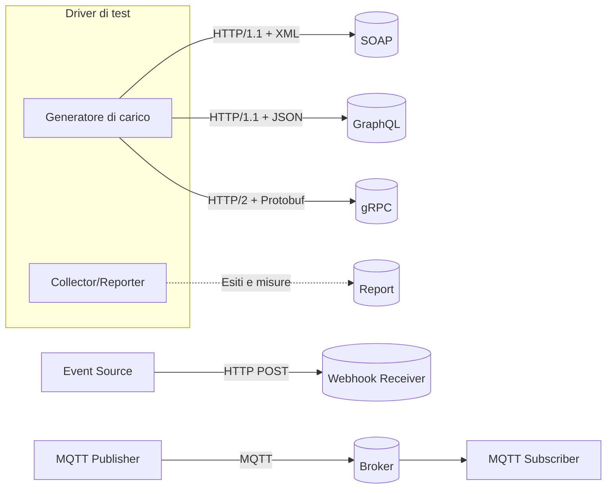

# API Benchmark Project

Progetto comparativo sulle tecnologie di comunicazione tra API: SOAP, GraphQL, gRPC, Webhooks e MQTT. L’obiettivo è capirne modello, architettura, casi d’uso e comportamento prestazionale con riferimenti affidabili e grafici esterni reperibili online.

# Indice
- [Panoramica](#panoramica)
- [Obiettivi](#obiettivi)
- [Tecnologie analizzate](#tecnologie-analizzate)
- [Architettura logica](#architettura-logica)
- [Benchmark](#benchmark)
  - [Metriche e metodo](#metriche-e-metodo)
  - [Galleria di grafici esterni (fonti affidabili)](#galleria-di-grafici-esterni-fonti-affidabili)
- [Confronto rapido](#confronto-rapido)
- [Guida decisionale “quando usare cosa”](#guida-decisionale-quando-usare-cosa)
- [Sicurezza e osservabilità](#sicurezza-e-osservabilità)
- [Limitazioni e accuratezza](#limitazioni-e-accuratezza)
- [Ruoli](#ruoli)
- [Licenza](#licenza)
- [Sitografia (fonti verificate)](#sitografia-fonti-verificate)

# Panoramica
Analizziamo e confrontiamo:
- SOAP: protocollo standardizzato basato su XML, tipico di ambienti enterprise
- GraphQL: linguaggio di query con schema tipizzato e recupero “just enough data”
- gRPC: RPC ad alte prestazioni su HTTP/2 con Protocol Buffers
- Webhooks: notifiche push event-driven via callback HTTP
- MQTT: protocollo pub/sub leggero, ideale per IoT e reti instabili

# Obiettivi
- Studiare modello di comunicazione, architettura e pattern supportati
- Implementare esempi funzionali per ogni tecnologia (focus educativo)
- Confrontare prestazioni su: latenza (p50/p95/p99), throughput, errore, efficienza di banda
- Evidenziare vantaggi, limiti e casi d’uso tipici, con riferimenti e grafici di terze parti affidabili

# Tecnologie analizzate
- SOAP
  - Standard W3C, messaggi XML, WSDL per descrizione servizi, fault model integrato
  - Pro: standardizzazione e WS-* per sicurezza/affidabilità; Contro: overhead elevato
- GraphQL
  - Query flessibili, schema tipizzato, introspezione; subscriptions via WS/SSE
  - Pro: evita over/under-fetching; Contro: caching HTTP meno diretto; attenzione a query “costose”
- gRPC
  - HTTP/2 + Protobuf binari, streaming client/server/bidirezionale
  - Pro: bassa latenza e overhead; Contro: meno adatto a frontend browser puro
- Webhooks
  - Eventi push verso endpoint registrati; richiede firma HMAC, retry/backoff, idempotenza
  - Pro: semplice integrazione near real-time; Contro: affidabilità distribuita da gestire
- MQTT
  - Pub/Sub leggero su broker, QoS 0/1/2, retained messages, last will
  - Pro: ideale per IoT/edge; Contro: non nativamente request/response

# Architettura logica

# Benchmark

## Metriche e metodo
- Latenza: p50/p95/p99 in millisecondi
- Throughput: richieste/messaggi al secondo (RPS/MPS)
- Error rate: frazione o percentuale di richieste fallite
- Efficienza di banda: payload utile / byte complessivi su rete

Linee guida per confronti onesti:
- Stesso ambiente (HW, rete, runtime), warm-up prima delle misure
- Carico a step crescenti, payload comparabili e pattern equivalenti
- Risultati sempre accompagnati da metodo, parametri e limiti di validità

## Galleria di grafici esterni (fonti affidabili)
I seguenti link rimandano a grafici pubblici e autorevoli. Ogni figura va interpretata nel contesto del setup usato dagli autori.

- gRPC e HTTP/2
  - gRPC — Benchmarking (documentazione ufficiale): https://grpc.io/docs/guides/benchmarking/
    - Panoramica del framework di benchmark gRPC e link ai risultati; tipicamente mostra latenza e throughput vs dimensione messaggi/concorrenti
  - Cloudflare Blog — Analisi prestazioni HTTP/2: https://blog.cloudflare.com/tag/http2/
    - Grafici su multiplexing, latenza e priorità in HTTP/2, rilevanti per comprendere i vantaggi di gRPC sul trasporto

- GraphQL
  - Hasura — GraphQL Benchmarks (repo pubblico): https://github.com/hasura/graphql-benchmarks
    - Confronti tra server GraphQL con grafici di latenza/throughput per varie query e carichi
  - Apollo/Engineering (panoramiche su performance e query cost): https://www.apollographql.com/blog/engineering/
    - Articoli con figure su query planning, caching e impatto sulla latenza lato client/server

- MQTT
  - EMQX — MQTT Performance Benchmark: https://www.emqx.com/en/blog/mqtt-performance-benchmark
    - Grafici su throughput, latenza e connessioni simultanee del broker MQTT sotto diversi QoS e dimensioni payload
  - HiveMQ — Benchmark e MQTT Essentials: https://www.hivemq.com/blog/tag/benchmark/
    - Serie di post con grafici su prestazioni broker MQTT, QoS e overhead rispetto a HTTP

- Webhooks (affidabilità/ritenti, latenza)
  - Stripe — Webhooks affidabili in produzione: https://stripe.com/docs/webhooks
    - Diagrammi e linee guida su consegna, retry/backoff, firma; spesso includono grafici/esempi di tempi e flussi
  - Segment (Twilio Segment) — Webhooks a scala elevata: https://segment.com/blog/
    - Articoli tecnici con figure su pipeline eventi, latenze e best practice per la consegna

- SOAP vs REST (overhead e performance)
  - Apache CXF — Performance: https://cxf.apache.org/performance.html
    - Grafici e tabelle di throughput/latency per JAX-WS (SOAP) e JAX-RS (REST) in vari scenari
  - Studi accademici (spesso con grafici comparativi):
    - IEEE/ACM digital libraries (query: “Performance comparison SOAP REST gRPC GraphQL”)

Note legali e di accuratezza:
- Verificare sempre la licenza prima di incorporare immagini di terzi in un README pubblico (molti contenuti sono CC BY-SA o con copyright proprietario).
- I risultati sono specifici al setup dell’autore (linguaggio, librerie, rete, hardware). Usare i grafici come riferimento qualitativo, non come verità universale.

# Confronto rapido
- SOAP
  - Pro: forte standardizzazione, contratti WSDL, WS-* (security/reliable)
  - Contro: messaggi verbosi, overhead elevato
- GraphQL
  - Pro: evita over/under-fetching, schema tipizzato, introspezione
  - Contro: caching HTTP meno immediato, rischio query costose
- gRPC
  - Pro: bassa latenza e overhead, streaming, contratti .proto
  - Contro: tooling HTTP tradizionale meno immediato, non pensato per browser
- Webhooks
  - Pro: integrazione semplice, push near real-time
  - Contro: gestione affidabilità/sicurezza a carico degli integratori
- MQTT
  - Pro: leggero, QoS, ideale per IoT/edge
  - Contro: semantica applicativa a carico dei client, non request/response

# Guida decisionale “quando usare cosa”
- gRPC: microservizi interni, comunicazioni S2S a bassa latenza, streaming bidirezionale
- GraphQL: front-end data‑centric con necessità di “shape” flessibile e aggregazioni
- Webhooks: integrazioni SaaS event‑driven, notifiche near real‑time
- MQTT: dispositivi/renti intermittenti, banda ridotta, topologie hub‑and‑spoke
- SOAP: contesti enterprise legacy, contratti formali e requisiti WS-*

# Sicurezza e osservabilità
- Autenticazione e autorizzazione adeguate al contesto (token, MTLS, firma HMAC)
- Rate limiting, backoff, idempotenza, deduplica per flussi asincroni (webhooks/MQTT)
- Metriche chiave: latenza pXX, error rate, retry, code 4xx/5xx, drop, saturazione risorse
- Tracing distribuito per correlare chiamate (es. W3C Trace Context)

# Limitazioni e accuratezza
- Le performance dipendono da implementazione, hardware, rete, payload e pattern. Ogni grafico va letto nel contesto in cui è stato prodotto.
- Le descrizioni tecniche sono allineate alle specifiche ufficiali; i link inclusi rimandano a fonti affidabili e pubbliche.
- Evitiamo indicazioni operative troppo specifiche: l’impostazione è volutamente generale e agnostica rispetto all’organizzazione del codice.

# Ruoli
- MQTT — ARDENTE VITTORIO FRANCESCO
- GraphQL — COLCOL JEROME
- gRPC — GAMBA ALESSANDRO
- SOAP — IQBAL UMAR
- Webhooks — PREVITALI MATTIA

# Licenza
Scegli una licenza libera e chiara (es. MIT, Apache‑2.0, GPL‑3.0). Guida: https://choosealicense.com/

# Sitografia (fonti verificate)
- SOAP
  - W3C SOAP 1.2: https://www.w3.org/TR/soap12-part1/
  - WSDL 1.1: https://www.w3.org/TR/wsdl
  - WS‑Security (OASIS): https://docs.oasis-open.org/wss-m/wss/v1.1.1/os/wss-SOAPMessageSecurity-v1.1.1-os.html
- GraphQL
  - Sito ufficiale: https://graphql.org/
  - Specifica: https://spec.graphql.org/
- gRPC
  - Documentazione: https://grpc.io/docs/
  - Protocol Buffers: https://protobuf.dev/
  - HTTP/2 (RFC 7540): https://www.rfc-editor.org/rfc/rfc7540
- Webhooks
  - Best practice (GitHub): https://docs.github.com/webhooks
  - Stripe Webhooks: https://stripe.com/docs/webhooks
  - Webhooks.fyi (catalogo/pratiche): https://webhooks.fyi/
- MQTT
  - Sito ufficiale: https://mqtt.org/
  - OASIS MQTT v3.1.1: https://docs.oasis-open.org/mqtt/mqtt/v3.1.1/os/mqtt-v3.1.1-os.html
  - OASIS MQTT v5.0: https://docs.oasis-open.org/mqtt/mqtt/v5.0/os/mqtt-v5.0-os.html
- Grafici e benchmark esterni
  - gRPC Benchmarking: https://grpc.io/docs/guides/benchmarking/
  - Cloudflare — HTTP/2 performance (tag): https://blog.cloudflare.com/tag/http2/
  - Hasura — GraphQL Benchmarks: https://github.com/hasura/graphql-benchmarks
  - EMQX — MQTT Performance Benchmark: https://www.emqx.com/en/blog/mqtt-performance-benchmark
  - HiveMQ — Benchmark posts: https://www.hivemq.com/blog/tag/benchmark/
  - Segment — Webhooks a scala elevata: https://segment.com/blog/

