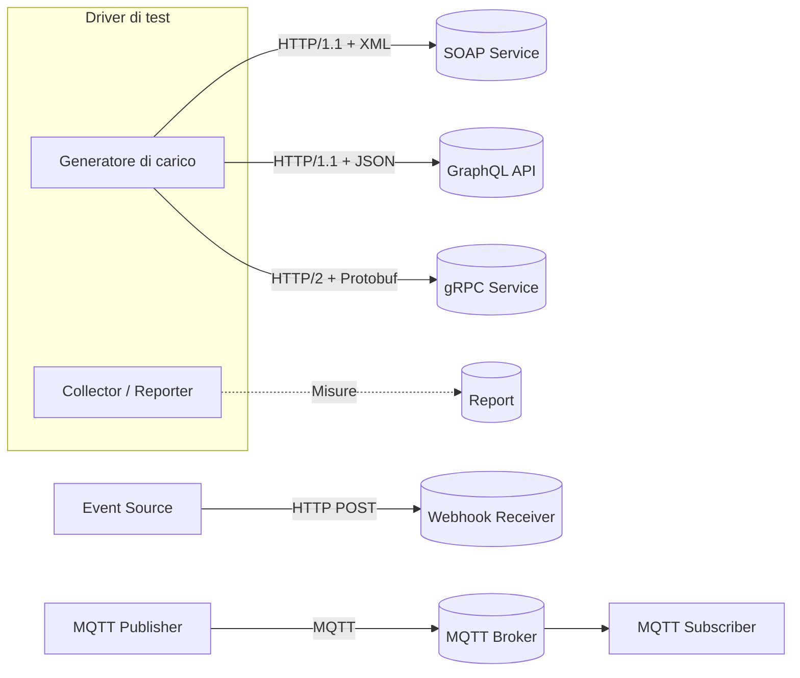
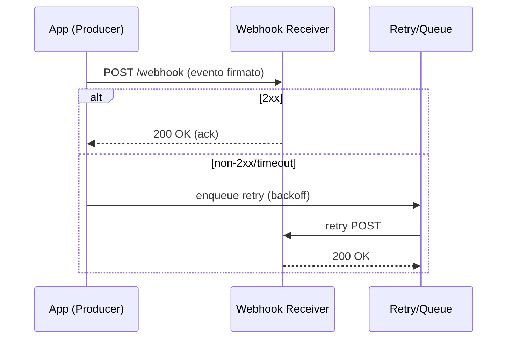
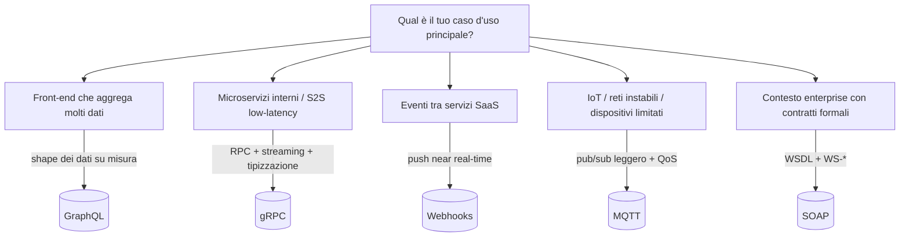

# API Benchmark Project

Studio comparativo e pratico delle principali tecnologie di comunicazione tra API: SOAP, GraphQL, gRPC, Webhooks e MQTT. Obiettivo: capirne modelli, architetture, casi d’uso e comportamento prestazionale con schemi chiari e una piccola galleria di grafici pubblici e affidabili.

# Indice
- [Panoramica](#panoramica)
- [Obiettivi](#obiettivi)
- [Tecnologie analizzate](#tecnologie-analizzate)
- [Schemi (alto livello)](#schemi-alto-livello)
- [Benchmark](#benchmark)
  - [Metriche e metodo](#metriche-e-metodo)
  - [Galleria di grafici esterni affidabili](#galleria-di-grafici-esterni-affidabili)
- [Confronto rapido](#confronto-rapido)
- [Guida decisionale: quando usare cosa](#guida-decisionale-quando-usare-cosa)
- [Sicurezza e osservabilità](#sicurezza-e-osservabilità)
- [Limitazioni e accuratezza](#limitazioni-e-accuratezza)
- [Ruoli](#ruoli)
- [Licenza](#licenza)
- [Sitografia (fonti verificate)](#sitografia-fonti-verificate)
- [Glossario](#glossario)
- [FAQ](#faq)

# Panoramica
Analizziamo cinque approcci diversi allo scambio dati tra servizi:
- SOAP: protocollo standardizzato basato su XML, molto usato in contesti enterprise
- GraphQL: linguaggio di query con schema tipizzato che evita over/under‑fetching
- gRPC: RPC ad alte prestazioni su HTTP/2 con Protocol Buffers binari
- Webhooks: notifiche push event‑driven via callback HTTP
- MQTT: protocollo pub/sub leggero su broker, ideale per IoT e reti instabili

# Obiettivi
- Capire modello di comunicazione e architettura di ciascuna tecnologia
- Mostrare esempi funzionanti dei pattern tipici (query/RPC/eventi/pub‑sub)
- Confrontare prestazioni su: latenza (p50/p95/p99), throughput, tasso d’errore, efficienza di banda
- Riassumere pro/contro e casi d’uso tipici con riferimenti esterni affidabili

# Tecnologie analizzate
- SOAP
  - Standard W3C, messaggi XML, WSDL per descrizione servizi, fault model integrato
  - Pro: standardizzazione e WS‑* per sicurezza/affidabilità; Contro: overhead elevato
- GraphQL
  - Query flessibili, schema tipizzato, introspezione; subscriptions via WS/SSE
  - Pro: evita over/under‑fetching; Contro: caching HTTP meno diretto; attenzione a query “costose”
- gRPC
  - HTTP/2 + Protobuf binari, streaming client/server/bidirezionale
  - Pro: bassa latenza e overhead; Contro: meno adatto a frontend browser puro
- Webhooks
  - Eventi push verso endpoint registrati; richiede firma HMAC, retry/backoff, idempotenza
  - Pro: semplice integrazione near real‑time; Contro: affidabilità distribuita da gestire
- MQTT
  - Pub/Sub leggero su broker, QoS 0/1/2, retained messages, last will
  - Pro: ideale per IoT/edge; Contro: non nativamente request/response

# Schemi (alto livello)

# Benchmark

## Metriche e metodo
- Latenza: p50, p95, p99 (millisecondi)
- Throughput: richieste/messaggi al secondo (RPS/MPS)
- Error rate: frazione o percentuale di richieste fallite
- Efficienza di banda: payload utile / byte complessivi su rete

Linee guida per confronti onesti (agnostiche rispetto all’implementazione):
- Ambiente coerente (HW, rete, runtime), warm‑up prima delle misure
- Carico crescente a step e payload confrontabili
- Pattern equivalenti nei test base (unary); streaming valutato separatamente dove previsto
- Risultati sempre accompagnati da descrizione del setup e dei limiti

## Galleria di grafici esterni affidabili
Di seguito includiamo grafici/figure pubbliche e autorevoli. Per rispetto delle licenze, linkiamo e attribuiamo chiaramente le fonti. Se la licenza del contenuto lo consente, puoi incorporare direttamente le immagini nel README.

- gRPC — Benchmarking ufficiale
  - Fonte: gRPC, “Benchmarking” (documentazione) — https://grpc.io/docs/guides/benchmarking/
  - Cosa mostra: latenza e throughput al variare di concorrenti e dimensione messaggi (HTTP/2 + Protobuf).
  - Anteprima: https://grpc.io/docs/guides/benchmarking/ (consulta i grafici nella pagina)
- HTTP/2 — Impatti su latenza e multiplexing
  - Fonte: Cloudflare Blog, raccolta su HTTP/2 — https://blog.cloudflare.com/tag/http2/
  - Cosa mostra: benefici del multiplexing su code di richieste, riduzione head‑of‑line blocking.
- GraphQL — Confronto server (benchmark pubblici)
  - Fonte: Hasura, “graphql-benchmarks” (repo) — https://github.com/hasura/graphql-benchmarks
  - Cosa mostra: throughput e latenza per diverse implementazioni di server GraphQL e pattern di query.
- MQTT — Benchmark di broker a carico variabile
  - Fonte: EMQX, “MQTT Performance Benchmark” — https://www.emqx.com/en/blog/mqtt-performance-benchmark
  - Cosa mostra: latenze, connessioni simultanee, throughput sotto QoS e payload diversi.
- MQTT — Test comparativi e best practice
  - Fonte: HiveMQ Blog (tag benchmark) — https://www.hivemq.com/blog/tag/benchmark/
  - Cosa mostra: andamento di throughput/latency con diversi QoS e dimensioni messaggi.
- Webhooks — Affidabilità e tempi di consegna
  - Fonte: Stripe Docs, “Webhooks” — https://stripe.com/docs/webhooks
  - Cosa mostra: tempi di consegna tipici, flussi di retry/backoff, firme HMAC.
- SOAP vs REST — Throughput/latency in stack Java
  - Fonte: Apache CXF, “Performance” — https://cxf.apache.org/performance.html
  - Cosa mostra: tabelle e grafici comparativi per JAX‑WS (SOAP) vs JAX‑RS (REST).

# Confronto rapido
- SOAP
  - Pro: forte standardizzazione, contratti WSDL, WS‑Security/WS‑ReliableMessaging
  - Contro: messaggi verbosi e overhead elevato
- GraphQL
  - Pro: evita over/under‑fetching, schema tipizzato, introspezione
  - Contro: caching HTTP meno immediato, rischio query “costose”
- gRPC
  - Pro: bassa latenza e overhead, streaming, contratti .proto forti
  - Contro: tooling HTTP tradizionale meno immediato, non pensato per browser
- Webhooks
  - Pro: integrazione semplice, push near real‑time
  - Contro: gestione affidabilità/sicurezza a carico di mittente e ricevente
- MQTT
  - Pro: leggero, QoS 0/1/2, ideale per IoT/edge
  - Contro: semantica applicativa a carico dei client, non request/response nativo

# Guida decisionale: quando usare cosa

# Sicurezza e osservabilità
- Autenticazione e autorizzazione
  - SOAP: WS‑Security (firma/cifratura)
  - GraphQL: auth per campo/operazione; limiti su profondità/costo query
  - gRPC: TLS/mTLS; credenziali via metadata
  - Webhooks: firme HMAC, timestamp e replay protection
  - MQTT: TLS, ACL per topic, autenticazione utente/certificati
- Affidabilità e resilienza
  - Retry con backoff esponenziale; idempotency key; deduplica
  - Circuit breaker e timeouts coerenti lato client/server
- Osservabilità
  - Metriche: p50/p95/p99, throughput, errori, retry/dlq
  - Tracing distribuito (W3C Trace Context) per correlare le chiamate

# Limitazioni e accuratezza
- Le performance dipendono da implementazione, hardware, rete, payload e pattern: i risultati di terzi sono indicativi e vanno letti nel loro contesto
- Le descrizioni tecniche seguono specifiche ufficiali e documentazione primaria (vedi Sitografia)
- Per grafici incorporati, rispetta licenze e attribuzioni degli autori

# Ruoli
- MQTT — ARDENTE VITTORIO FRANCESCO
- GraphQL — COLCOL JEROME
- gRPC — GAMBA ALESSANDRO
- SOAP — IQBAL UMAR
- Webhooks — PREVITALI MATTIA

# Sitografia (fonti verificate)
- SOAP
  - W3C SOAP 1.2: https://www.w3.org/TR/soap12-part1/
  - WSDL 1.1: https://www.w3.org/TR/wsdl
  - WS‑Security (OASIS): https://docs.oasis-open.org/wss-m/wss/v1.1.1/os/wss-SOAPMessageSecurity-v1.1.1-os.html
- GraphQL
  - Sito ufficiale: https://graphql.org/
  - Specifica: https://spec.graphql.org/
- gRPC
  - Documentazione: https://grpc.io/docs/
  - Protocol Buffers: https://protobuf.dev/
  - HTTP/2 (RFC 7540): https://www.rfc-editor.org/rfc/rfc7540
- Webhooks
  - Best practice (GitHub): https://docs.github.com/webhooks
  - Stripe Webhooks: https://stripe.com/docs/webhooks
  - Webhooks.fyi (catalogo/pratiche): https://webhooks.fyi/
- MQTT
  - Sito ufficiale: https://mqtt.org/
  - OASIS MQTT v3.1.1: https://docs.oasis-open.org/mqtt/mqtt/v3.1.1/os/mqtt-v3.1.1-os.html
  - OASIS MQTT v5.0: https://docs.oasis-open.org/mqtt/mqtt/v5.0/os/mqtt-v5.0-os.html
- Grafici e benchmark esterni (selezione)
  - gRPC — Benchmarking: https://grpc.io/docs/guides/benchmarking/
  - Cloudflare — HTTP/2 performance: https://blog.cloudflare.com/tag/http2/
  - Hasura — GraphQL Benchmarks: https://github.com/hasura/graphql-benchmarks
  - EMQX — MQTT Performance Benchmark: https://www.emqx.com/en/blog/mqtt-performance-benchmark
  - HiveMQ — MQTT benchmark posts: https://www.hivemq.com/blog/tag/benchmark/
  - Segment — Event pipelines & webhooks: https://segment.com/blog/
  - Apache CXF — Performance: https://cxf.apache.org/performance.html

# Glossario
- p50/p95/p99: percentili di latenza (50°, 95°, 99°)
- RPS/MPS: richieste o messaggi al secondo
- Over‑fetching/Under‑fetching: troppi/pochi dati rispetto al necessario
- WS‑*: famiglia di specifiche per estendere SOAP (sicurezza/affidabilità)
- QoS (MQTT): livelli di garanzia di consegna (0/1/2)

# FAQ
- Posso usare GraphQL per streaming real‑time?
  - Sì tramite subscriptions, ma servono trasporti come WebSocket o SSE e un server che le supporti
- gRPC è adatto al frontend web?
  - Non direttamente (richiede HTTP/2 + Protobuf). In genere si espone una facciata HTTP/JSON per i browser
- MQTT è sicuro per produzione?
  - Con TLS, ACL e autenticazione corretta, sì. Scegli QoS adeguato e monitora risorse del broker
- SOAP è ancora usato?
  - Sì in ambienti enterprise/legacy, specialmente dove esistono contratti WSDL e policy WS‑* consolidate

